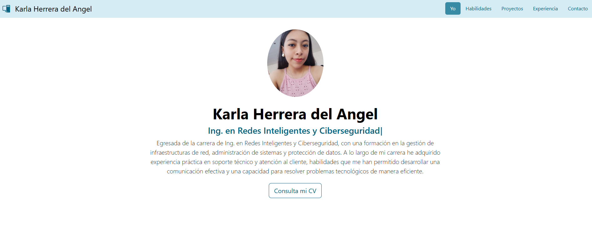
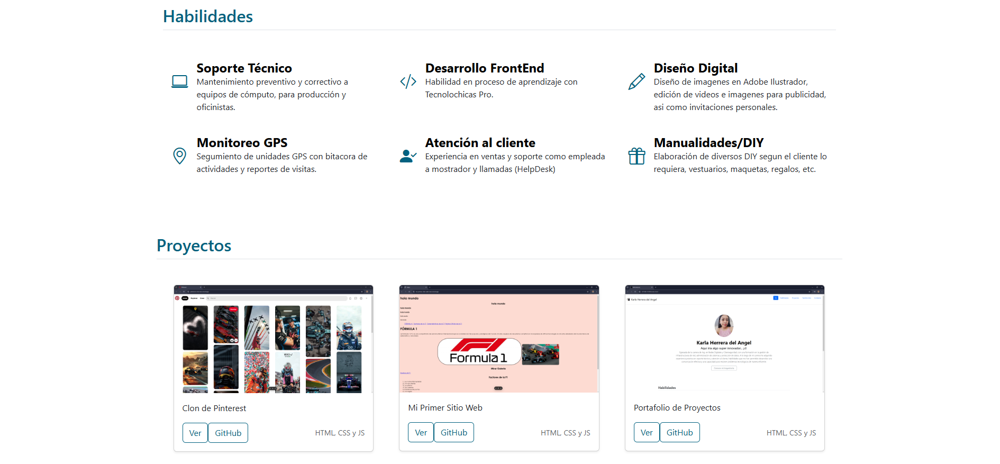
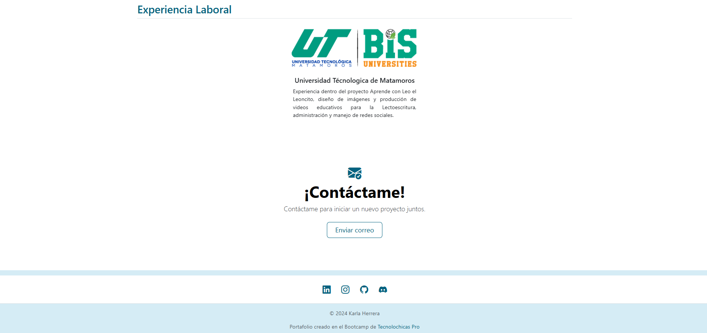

# Portafolio de Proyectos

¡Hola! Soy ***Karla Herrera***, aprendiz de desarrollo web...  

Aqui encontrarás alguna información sobre mí.
https://catcodesk.github.io/
___
### El proyecto cuenta con las secciones de:
- 🙌🏽 Habilidades 
- 💻 Proyectos 
- 💼 Experiencia laboral 
- 🌐 Contacto 

#### Creado con:
- HTML
- CSS
- Java Script

### Vista Previa

___
### *Espero saber de ti muy pronto 👀*
*Correo:*
[kl.herrera@outlook.com](mailto:kl.herrera@outlook.com)
___
### *Creado en el Bootcamp de Tecnolochicas Pro*
[👉🏽Tecnolochicas Pro 👈🏽](https://tecnolochicas.mx/)
